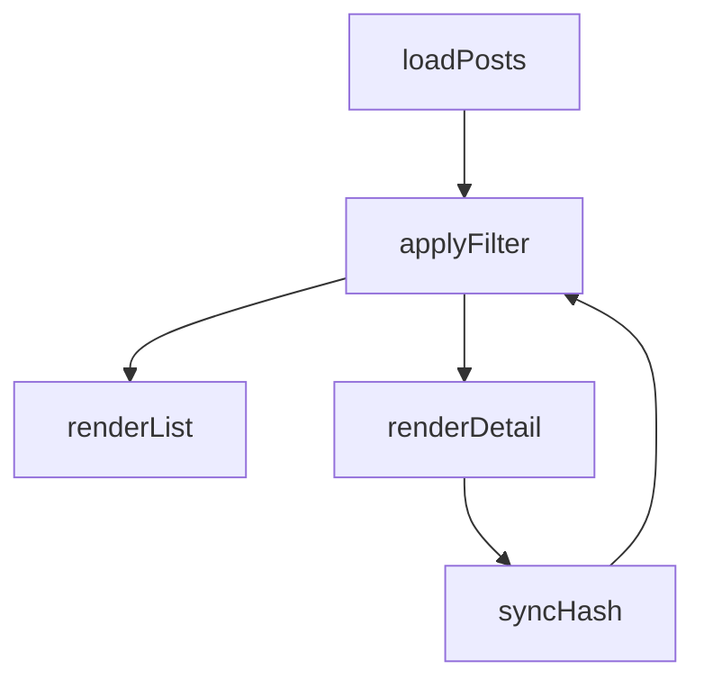

# Design Document

## Overview
本设计聚焦归档页面交互能力增强，采用“最小侵入改造”：在保持现有 HTML/CSS 架构的前提下，拆分 `app.js` 的职责，提升搜索与筛选体验，并保证 hash 深链的一致性。

## Steering Document Alignment

### Technical Standards (tech.md)
- 保持原生技术栈（HTML/CSS/JavaScript），不引入额外框架。
- 继续使用 `data/posts.json` 作为数据源。
- 优先通过纯函数实现过滤与排序逻辑，便于后续测试。

### Project Structure (structure.md)
- 先在单文件内分模块区域（Data / Filter / Render / Router）；
- 若复杂度继续上升，再拆分到独立文件。

## Code Reuse Analysis

### Existing Components to Leverage
- **`app.js`**: 复用现有 state、`renderList`、`renderDetail` 基础逻辑。
- **`styles.css`**: 复用现有布局与卡片样式，增量添加搜索与状态样式。
- **`index.html`**: 复用现有结构，新增搜索输入框和状态提示区。

### Integration Points
- **`data/posts.json`**: 继续作为初始化数据来源。
- **`window.location.hash`**: 继续用于文章直链。

## Architecture

整体采用“状态驱动 UI”模型：

1. Data Layer：加载并预处理文章数据
2. Filter Layer：组合标签和关键词过滤
3. Presentation Layer：渲染列表与详情
4. Routing Layer：读写 hash，实现直链同步



## Components and Interfaces

### `getFilteredPosts(posts, activeTag, keyword)`
- **Purpose:** 统一计算过滤结果
- **Interfaces:** 输入原始文章和过滤条件，输出过滤后数组
- **Dependencies:** 无（纯函数）
- **Reuses:** 复用现有标签过滤条件

### `syncActivePostFromHash(posts, filteredPosts, hashId)`
- **Purpose:** 在 hash 变化时计算激活文章
- **Interfaces:** 返回合法的 `activeId`
- **Dependencies:** `window.location.hash`
- **Reuses:** 复用现有 `getHashPostId` 思路

### `renderStatus(state)`
- **Purpose:** 渲染加载失败、无匹配、无文章等状态
- **Interfaces:** 根据 state 输出状态文案
- **Dependencies:** DOM
- **Reuses:** 复用现有 `.empty` 视觉样式

## Data Models

### Post
```text
- id: number
- title: string
- date: string (ISO-like)
- tags: string[]
- content: string
- sourceUrl: string
```

### ViewState
```text
- posts: Post[]
- filteredPosts: Post[]
- activeTag: string
- keyword: string
- activeId: number | null
- loadingState: "idle" | "loading" | "error"
```

## Error Handling

### Error Scenarios
1. **数据加载失败**
   - **Handling:** 捕获 fetch 异常并设置 `loadingState = error`
   - **User Impact:** 显示“数据加载失败，请稍后重试”

2. **hash 无效或不存在**
   - **Handling:** 回退到过滤结果第一项或空状态
   - **User Impact:** 页面可继续使用，不中断

3. **过滤后无结果**
   - **Handling:** 列表置空并展示无匹配提示
   - **User Impact:** 用户知道当前条件下没有匹配内容

## Testing Strategy

### Unit Testing
- 过滤函数：标签、关键词、组合条件
- hash 同步函数：有效/无效 ID 分支

### Integration Testing
- 标签切换后列表与详情联动
- 关键词变化后详情 fallback 行为

### End-to-End Testing
- 打开 `#<id>` 直链 -> 显示对应文章
- 切换文章 -> hash 同步更新
- 无匹配 -> 空状态提示正确显示
