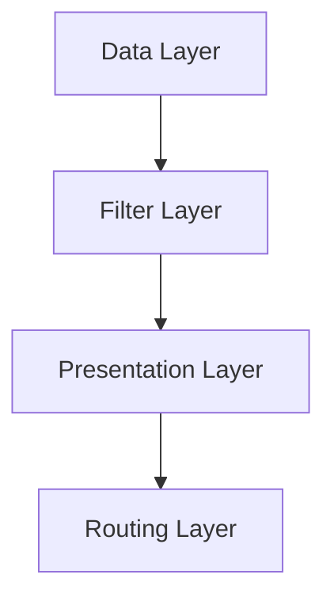

# Design Document

## Overview
[高层描述功能方案及其在系统中的位置]

## Steering Document Alignment

### Technical Standards (tech.md)
[说明如何遵循 tech.md 的技术标准]

### Project Structure (structure.md)
[说明如何遵循 structure.md 的结构约束]

## Code Reuse Analysis
[分析复用、扩展、替换哪些现有代码]

### Existing Components to Leverage
- **[组件/工具名]**: [复用方式]
- **[服务/工具名]**: [扩展方式]

### Integration Points
- **[现有系统/API]**: [集成方式]
- **[数据层/存储]**: [数据连接方式]

## Architecture
[描述总体架构与关键设计模式]

### Modular Design Principles
- **Single File Responsibility**
- **Component Isolation**
- **Service Layer Separation**
- **Utility Modularity**



## Components and Interfaces

### Component 1
- **Purpose:** [职责]
- **Interfaces:** [公开接口]
- **Dependencies:** [依赖]
- **Reuses:** [复用对象]

### Component 2
- **Purpose:** [职责]
- **Interfaces:** [公开接口]
- **Dependencies:** [依赖]
- **Reuses:** [复用对象]

## Data Models

### Model 1
```text
- id: [类型]
- name: [类型]
- ...
```

## Error Handling

### Error Scenarios
1. **Scenario 1:** [异常场景]
   - **Handling:** [处理方式]
   - **User Impact:** [用户可见结果]

## Testing Strategy

### Unit Testing
[单元测试范围]

### Integration Testing
[集成测试范围]

### End-to-End Testing
[E2E 测试范围]
